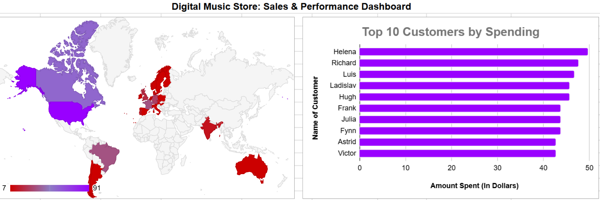

# SQL-Powered Analysis of a Digital Music Store

## 1. Project Objective
This project simulates a real-world business intelligence task where I acted as a data analyst for a digital music store. The primary objective was to query the store's relational database using SQL to uncover key insights related to sales, customer behavior, product performance, and employee effectiveness. The final goal was to translate these findings into a clear, easy-to-understand dashboard for management.

---

## 2. Tools & Techniques
* **Database Management:** **DBeaver** for connecting to the database and executing queries.
* **SQL:** Used for complex data extraction, including multi-table `JOIN`s, `GROUP BY` clauses for aggregation, and `ORDER BY` for ranking.
* **Data Visualization:** **Google Sheets** for creating a clean, professional dashboard with various charts (Geo, Bar, Donut, and Combo charts).

---

## 3. The Process
1.  **Database Exploration:** I began by exploring the 11 interconnected tables in the Chinook database schema to understand the relationships between artists, albums, customers, and invoices.
2.  **SQL Querying:** I wrote five distinct SQL queries to answer specific business questions. Each query was saved as a separate `.sql` file, which you can find in this repository.
3.  **Data Export:** The results of each query were exported as CSV files.
4.  **Dashboard Creation:** The exported data was imported into Google Sheets, where I created five distinct charts that were assembled into a single, comprehensive dashboard.

---

## 4. Analysis & Key Findings
* **Finding 1: Global Sales Distribution**
    * **Insight:** The USA is the dominant market, followed by Canada and France. However, Europe as a continent represents a significant portion of total sales.
    * **Recommendation:** While continuing to nurture the US market, a targeted marketing campaign focused on key European countries could yield a high return on investment.

* **Finding 2: Top-Performing Artists & Genres**
    * **Insight:** **Rock** is by far the best-selling genre, and the top-selling artist is **Iron Maiden**. This highlights that the store's most valuable customers are likely dedicated fans of classic rock and metal.
    * **Recommendation:** The store should heavily feature Rock music in promotions. Artist-specific campaigns, starting with Iron Maiden, could be highly effective in engaging the core customer base.

* **Finding 3: Customer Spending Habits**
    * **Insight:** Spending is more evenly distributed across the customer base compared to a typical retail store, indicating a broad and healthy user base rather than a reliance on a few VIPs.
    * **Recommendation:** Marketing efforts should focus on broad engagement and new customer acquisition.

* **Finding 4: Employee Performance**
    * **Insight:** The data clearly identifies the top-performing sales support agents based on both the value and volume of sales they have driven.
    * **Recommendation:** Management can use this data to create a data-driven bonus program and identify coaching opportunities for other agents.

---

## 5. Final Dashboard & Live Report

The final results were visualized in a comprehensive Google Sheets dashboard. All SQL query files used for this analysis are available in this repository.

**➡️ [[View the Live Interactive Dashboard Here]](https://docs.google.com/spreadsheets/d/1ZblPkpJYGG5kV9g3SFcgU7BsVc27JWcCanzUHYO7sko/edit?usp=sharing)**

